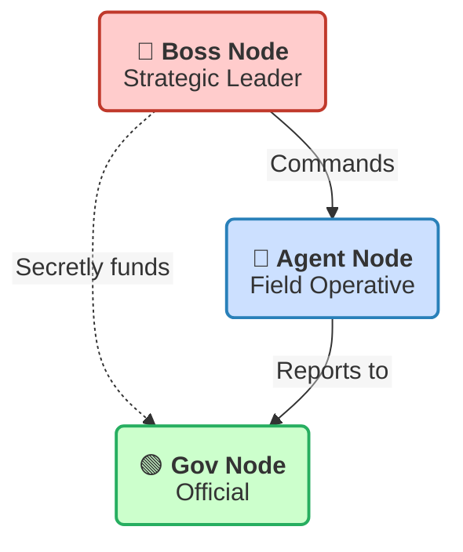

## What I do
- Write Mermaid flowcharts, sequence diagrams, class diagrams, and other diagram types
- Produce multiline node labels that actually render as separate lines
- Choose colors and themes that are readable in both light and dark environments
- Adapt syntax to the specific renderer the user is using

---

## Renderer behavior matrix

Different renderers handle node label line breaks differently. Always ask which renderer is being used if not specified.

| Renderer | Working line break syntax | Notes |
|---|---|---|
| **Chrome markdown extension** (markdown-viewer/markdown-viewer-extension) | Blank line inside backtick string | `display: table; white-space: break-spaces` — `<br>` inside `<p>` is ignored; blank line creates new `<p>` which stacks |
| **GitHub** | `<br>` or `\n` in quoted label | htmlLabels true by default |
| **mermaid.live** | `\n` in quoted label or backtick string newline | Most permissive renderer |
| **Obsidian** | `<br>` (htmlLabels true) | Depends on installed Mermaid version |
| **VS Code** (Markdown Preview Mermaid Support) | `<br>` worked pre-v11; broken in v11+ | Known regression; `<br>` is workaround per extension docs |

---

## Multiline labels — canonical working syntax per renderer

### Chrome markdown extension (markdown-viewer-extension)

Use `htmlLabels: false` + backtick strings + **blank line** between lines:

```
---
config:
  theme: default
  htmlLabels: false
---
flowchart TD
    NODE("`**Bold Name**

Subtitle role`")
```

**Why blank line:** The renderer wraps labels in `<div style="display: table; white-space: break-spaces">` with a `<p>` tag. A `<br>` inside a single `<p>` is ignored by Chrome's SVG foreignObject. A blank line creates two separate `<p>` elements which stack vertically.

**Why `theme: default`:** With `htmlLabels: false`, the `color` property in `classDef` is not applied to text. Using `theme: default` ensures dark text on light background regardless of host app's dark mode.

### GitHub / mermaid.live

Use `htmlLabels: true` (default) with `<br>`:

```
flowchart TD
    NODE["**Bold Name**<br>Subtitle role"]
```

Or use backtick strings with literal newline (Mermaid v10+):

```
---
config:
  htmlLabels: false
---
flowchart TD
    NODE("`**Bold Name**
Subtitle role`")
```

---

## Color strategy

### With `htmlLabels: false` (Chrome extension, some others)
The `color` property in `classDef` does NOT apply to text — the renderer ignores it. Use **light pastel backgrounds** so that the default dark text (from `theme: default`) is always readable:

```
classDef boss      fill:#ffcccc,stroke:#c0392b,stroke-width:2px
classDef dea       fill:#cce0ff,stroke:#2980b9,stroke-width:2px
classDef gov       fill:#ccffcc,stroke:#27ae60,stroke-width:2px
classDef associate fill:#fff5cc,stroke:#e67e22,stroke-width:2px
classDef threat    fill:#e8ccff,stroke:#8e44ad,stroke-width:2px
```

Do NOT set `color:#fff` or any explicit text color — it will be overridden and dark text on dark bg will be invisible.

### With `htmlLabels: true` (GitHub, Obsidian)
`color` works correctly. Dark backgrounds with white text are fine:

```
classDef boss fill:#8B0000,color:#fff,stroke:#ff4444,stroke-width:2px
```

---

## Node shape reference

```
NODE["rectangular"]          %% square corners
NODE("rounded")              %% rounded corners  ← preferred for multiline in Chrome ext
NODE{diamond}                %% decision
NODE[(database)]             %% cylinder
NODE([stadium])              %% pill shape
NODE[[subroutine]]           %% double border
NODE>asymmetric]             %% asymmetric
NODE{{hexagon}}              %% hexagon
```

For the Chrome markdown extension, use `()` (rounded) shapes for multiline labels — the extra padding looks better than `[]` rectangular.

---

## Edge / arrow types

```
A --> B          %% solid arrow
A --- B          %% solid line, no arrow
A -.-> B         %% dashed arrow  ← use for betrayal, corruption, indirect relationships
A ==> B          %% thick arrow
A --o B          %% circle end
A --x B          %% cross end
A <--> B         %% bidirectional
A ---|label| B   %% labeled solid
A -->|label| B   %% labeled arrow
```

---

## Full working example — Chrome markdown extension



---

## Common mistakes to avoid

- **Never** use `<br/>` (self-closing) — not supported by Mermaid's HTML label parser
- **Never** use `<br>` inside backtick strings (`htmlLabels: false`) — it becomes `<br>` inside `<p>` which Chrome's SVG foreignObject ignores
- **Never** rely on literal newlines inside `"..."` double-quote labels — they are stripped
- **Never** set explicit `color` in `classDef` when using `htmlLabels: false` — it won't apply and may cause invisible text
- **Don't** use dark fill colors without testing text readability — `color:#fff` only works with `htmlLabels: true`
- **Don't** use `%%{init: ...}%%` and YAML frontmatter config at the same time — pick one
- **Always** ask which renderer is being used before writing multiline labels — there is no universal syntax
- **Always** use `theme: default` with `htmlLabels: false` to guarantee readable text
- **Always** prefer `()` rounded node shapes for multiline content — better visual padding
- **Always** use blank lines (not `<br>`) for line breaks in the Chrome markdown extension

---

## Diagram types and when to use them

| Type | Syntax start | Best for |
|---|---|---|
| Flowchart | `flowchart TD` / `flowchart LR` | Relationships, processes, hierarchies |
| Sequence | `sequenceDiagram` | Time-ordered interactions between actors |
| Class | `classDiagram` | OOP structure, data models |
| State | `stateDiagram-v2` | State machines, lifecycle flows |
| ER | `erDiagram` | Database schemas |
| Gantt | `gantt` | Project timelines |
| Pie | `pie` | Simple proportional data |
| Mindmap | `mindmap` | Hierarchical brainstorming |

For relationship graphs (people, organizations, networks), always use `flowchart TD` or `flowchart LR`.
